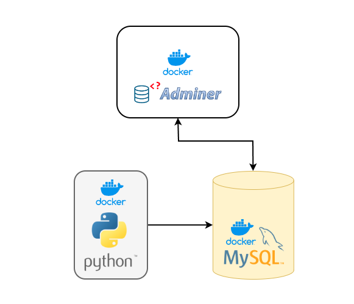

## Features

- The python code generates random data every 10 seconds with the current date and time
- python then connects to the MySQL instance and pushes the data into the relevant table in the database
- Considering the dependencies, the python docker image is built locally on the present system
- Setup is tried and tested on local and Amazon EC2 instances with a Public IP
 
## Prequisites

- docker 
- docker-compose
- Requested ports to be opened from the firewall
